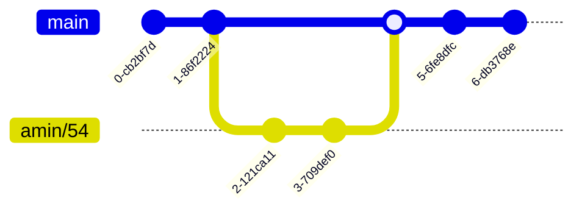
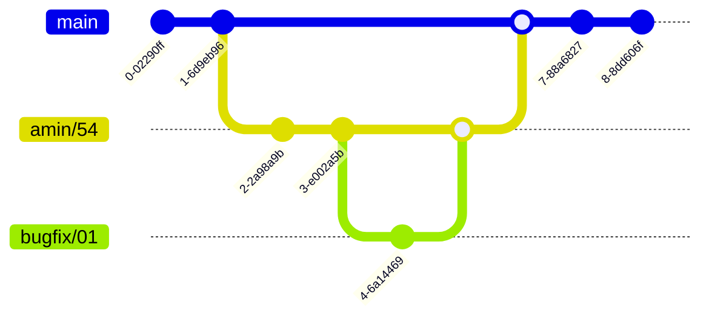

# Politica de ramas

Todo trabajo debe estar realizado en una rama y cada rama debe establecer una convención de nombre para poder ser identificable y fácilmente determinar su objetivo.

Un nombre de ejemplo de rama es:

#### amin/54

La rama contará primero con el nombre del autor y después de una diagonal contará con el número del **Issue** que deberá solucionar por lo que cada rama podrá ser creada ÚNICAMENTE si existe un Issue previamente creado. El proceso será como en el siguiente diagrama.

En caso de que exista un error o cualquier tipo de corrección dentro de la rama principal entonces podrás crear una rama con el prefijo **bugfix** que permitiría a cualquier otro usuario diferente al autor hacer cambios. Un ejemplo se puede ver en el siguiente diagrama.

