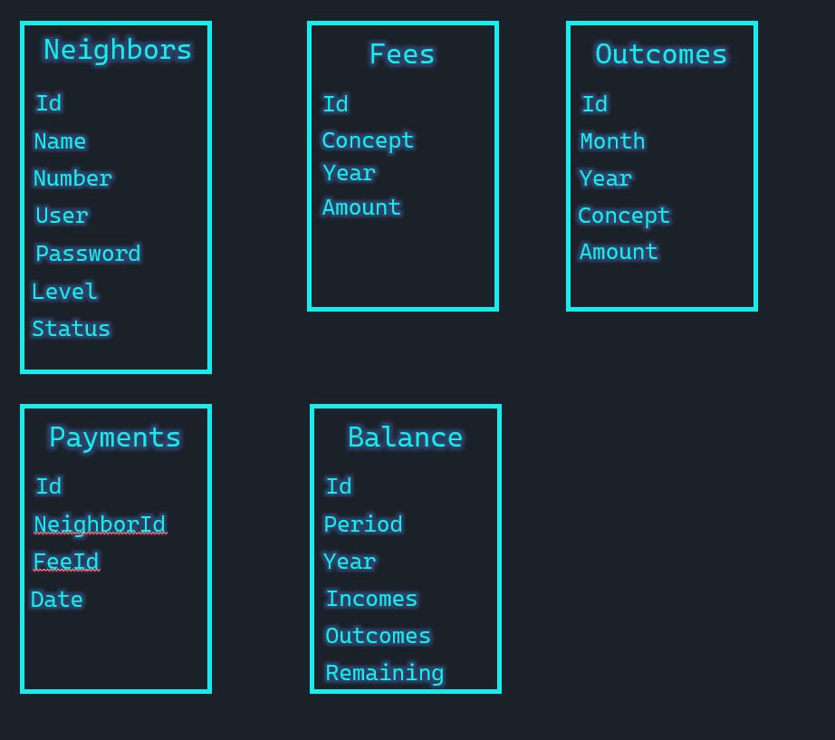

# Estructura de la base de datos

El siguiente esquema es el que se utilizará en la aplicación:



Para crear las tablas, podrás hacerlo con los siguientes comandos:

La tabla **vecinos**.

```sql
CREATE TABLE [dbo].[Neighbors] (
    [Id]       INT           IDENTITY (1, 1) NOT NULL,
    [Name]     NVARCHAR (70) NOT NULL,
    [Number]   INT           NOT NULL,
    [User]     NVARCHAR (50) NOT NULL,
    [Password] NVARCHAR (50) NOT NULL,
    [Level]    NVARCHAR (50) NOT NULL,
    [Status]   NVARCHAR (50) NOT NULL,
)
```

La tabla **pagos**.

```sql
CREATE TABLE [dbo].[Payments] (
    [Id]         INT  IDENTITY (1, 1) NOT NULL,
    [NeighborId] INT  NOT NULL,
    [FeeId]      INT  NOT NULL,
    [Date]       DATE NOT NULL,
)
```

La tabla **cuotas**.

```sql
CREATE TABLE [dbo].[Fees] (
    [Id]      INT           IDENTITY (1, 1) NOT NULL,
    [Concept] NVARCHAR (50) NOT NULL,
    [Year]    NVARCHAR (50) NOT NULL,
    [Amount]  MONEY         NOT NULL,
)
```

La tabla **balance**.

```sql
CREATE TABLE [dbo].[Balance] (
    [Id] INT NOT NULL IDENTITY (1, 1), 
    [Period] NVARCHAR(50) NOT NULL, 
    [Year] INT NOT NULL, 
    [Incomes] MONEY NOT NULL, 
    [Outcomes] MONEY NOT NULL, 
    [Remaining] INT NOT NULL
)
```

La tabla **egresos**.

```sql
CREATE TABLE [dbo].[Outcomes] (
    [Id] INT NOT NULL IDENTITY(1, 1), 
    [Month] NVARCHAR(50) NOT NULL, 
    [Year] INT NOT NULL, 
    [Concept] NVARCHAR(50) NOT NULL, 
    [Amount] MONEY NOT NULL
)
```
